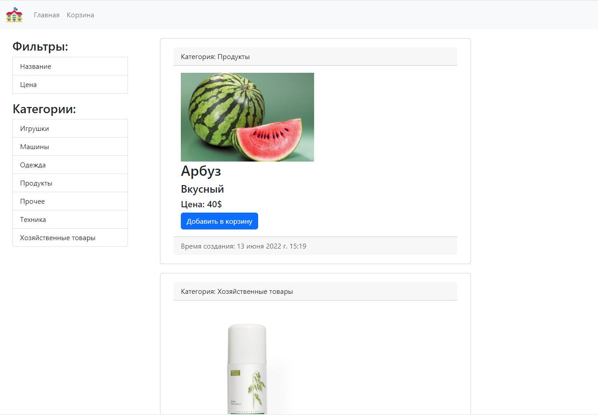

# Магазинчик

### 1. Установить все зависимости из requirements.txt

* **pip install -r requirements.txt** в корне проекта

### 2. Изучать маленький магазинчик :D

#### К примеру товаров оставил базу данных с некоторыми продуктами:

### В проекте использовал Python и Django

#### Также оставил набросок на словах как будет выглядеть примерный проект, можете ознакомиться :)