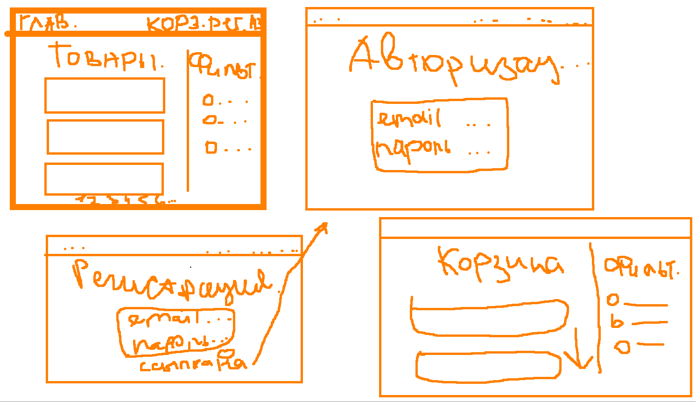

# Магазин.

## 1.0: Регистрация и Авторизация пользователей.

Отдельное окошечко только с авторизацией и регистрацией пользователей.

* белый фон.
* формочка в центре.

Если пользователь будет регистрироваться, то после успешной регистрации сразу телепорт на главную страницу.

Если пользователь будет авторизоваться, то после успешного входа будет телепортироваться на главную страницу.

И на страницы регистрации внизу формы будет ссылка на авторизацию, если пользователь уже имеет аккаунт.

## 2.0: Главная страница.

Это лента фильтрами слева или справа.

Возможно сделать в формочках или просто как-то ограничить фильтры от продуктов.

* сверху маленькая ленточка или просто hr, разделяющий регистрацию, авторизацию, 
корзину, ссылку на главную страницу и возможно что-то еще.
* белый фон.
* каждый новый продукт в квадратике например или какой-то формочке.
* фильтры справа, занимают < 40% места и не бросаются сильно в глаза.
* пагинация и нижняя ленточка например с логотипом магазина, кондефициальностью и т.д. ...

## 2.1: Товары.

На главной странице товары будут в какой-то маленькой обёртке, например только маленькая картинка, 
название, маленькое описание продукта, категория и цена.

Все товары будут отделяться маленьким отступом или окончанием формочки товара.

У каждого товара будет кнопочка "Узнать больше или что-то в это духе" 
и она будет редиректить на полное описание продукта с возможной кнопочкой назад в верхнем левом углу.
 
На полной странице товара внизу справа после формы товара будет кнопка "Добавить в корзину" для авторизированных 
пользователей, если пользователей не авторизирован, то редиректить на юрл регистрации пользователей.

## 2.1: Фильтры.

По фильтрам своеобразно, можно и много сделать, а можно и обойтись малым количеством.

Наверное точно будут фильтры: "По возрастанию и убыванию цены", "Категория товара", 
можно добавить по дате выпуска или например по "Недавно добавленные" и еще можно подумать об акциях и т.д.

## 2.2 Корзина.

Показываются все выбранные товары в корзине.

Можно отображать также как на главное странице с фильтрами, можно без.
Думаю, лучше с фильтрами (базовыми) например цена и срок добавления в корзину.

И конечно удаление продуктов из корзины.

### Вот накиданный дизайн за 2 минуты:

Думаю дизайн может измениться, но концепт такой.

P.S. - Да это paint за 3 минуты.